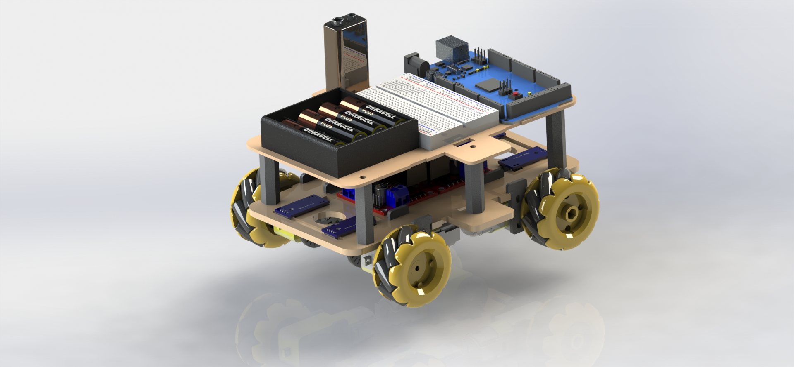
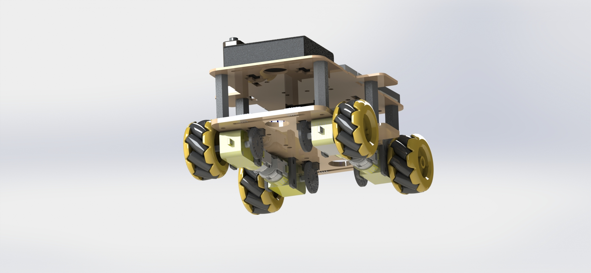
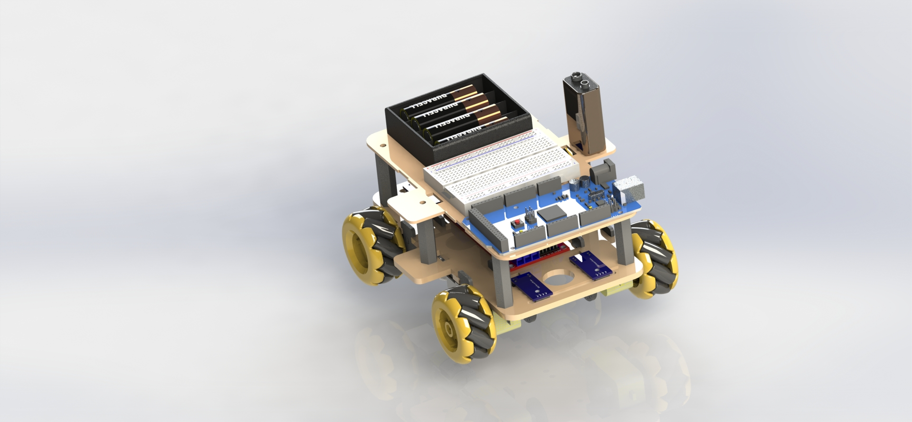

# Omnidirectional-Robot-Car
A robot that has the ability to move in more directions than usually possible using unique mecanum wheels.
Controlled using Joystick and NRF24 module.
Made in Platform IO.

## Instructions
- Use the Joystick_Receiver.ino in the src/Extras folder
- More coming soon

## Images
Rendered pictures of the 3D model I created using parts from [GrabCAD](https://grabcad.com/library) combined with my own models designed for 3D printing. Made in real-world scale and using `Solidworks`.

