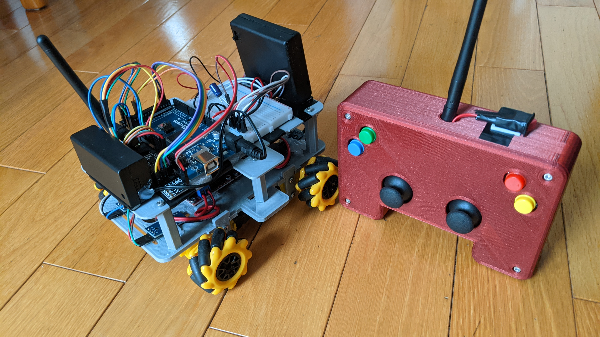
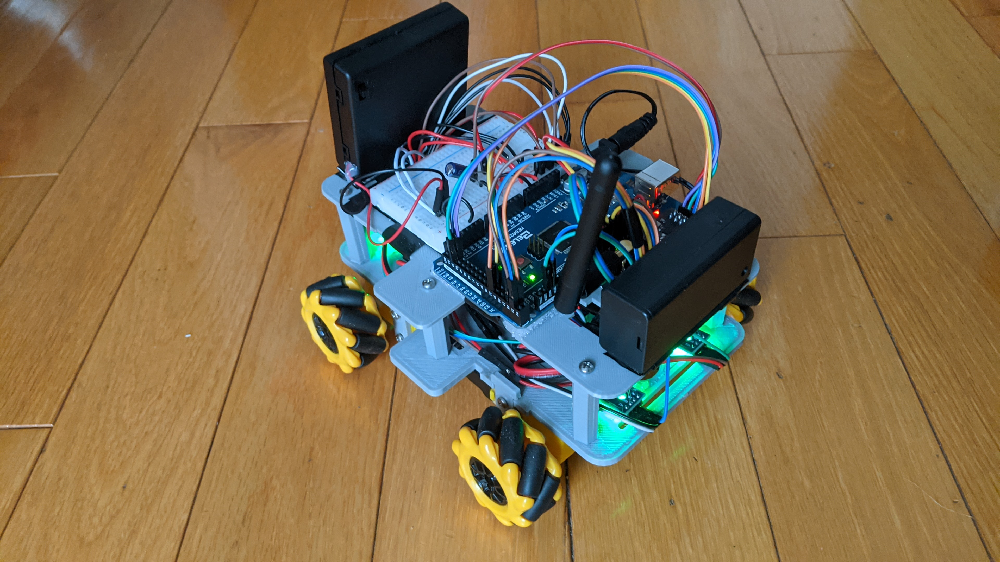
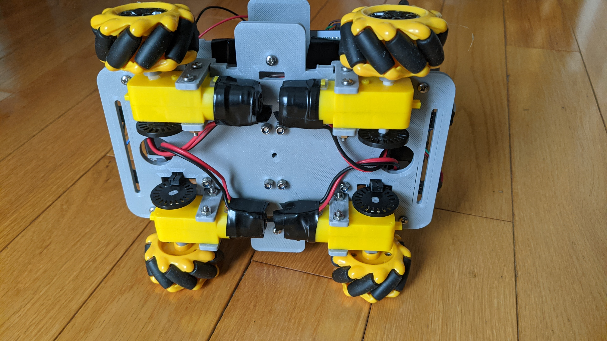
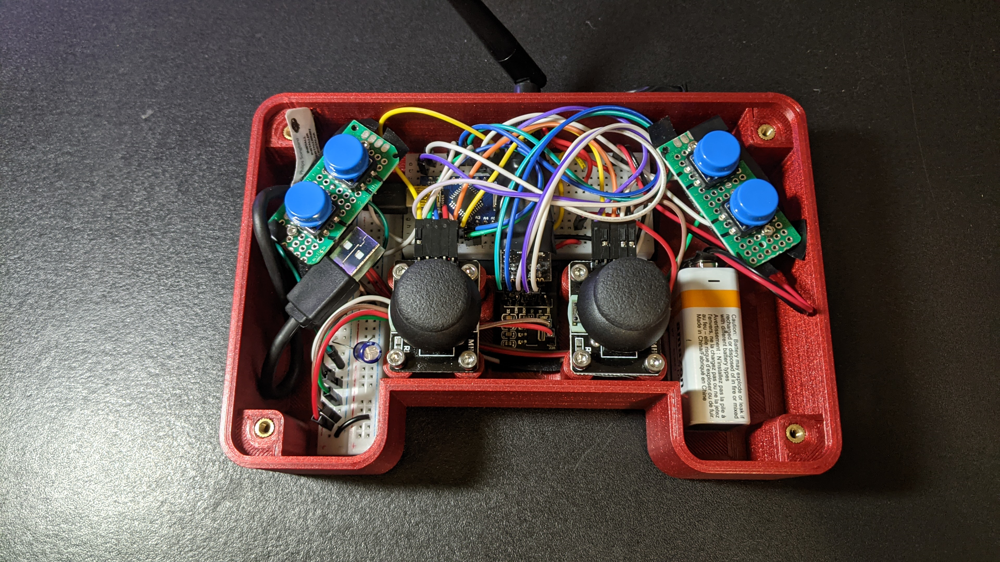

# OmniBot
A remote-controlled robot that has the ability to move in more directions than usually possible using unique mecanum wheels. 
Controlled using a custom-designed Joystick and nRF24L01 module.
Programmed in `Platform IO`, models created in `Solidworks`, schematics created in `KiCad`.

Some very short demos below (click on each one to visit the full video):

## Instructions
- Upload the OmniBot-Joystick.ino in the `src/OmniBot-Joystick` folder to the joystick
- The entire `Platform IO` project is to be uploaded to the OmniBot
- More coming soon

## Note
The OmniBot-Joystick is a slightly modified version of my [RC-Joystick](https://github.com/AshishA26/RC-Joystick).

## Schematics
Schematic for the OmniBot:

Schematic for the OmniBot Joystick:

## Images

The OmniBot and Joystick side by side:

<!--The OmniBot:

-->

Inside the joystick:

Rendered pictures of the 3D model I created using parts from [GrabCAD](https://grabcad.com/library) combined with my own models designed for 3D printing. Made in real-world scale and was designed using `Solidworks`:

For more images, please see the [images folder](https://github.com/AshishA26/OmniBot/tree/master/Images) of this repo.